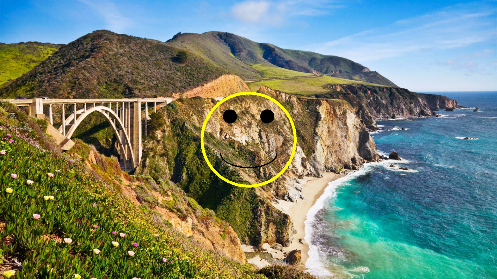
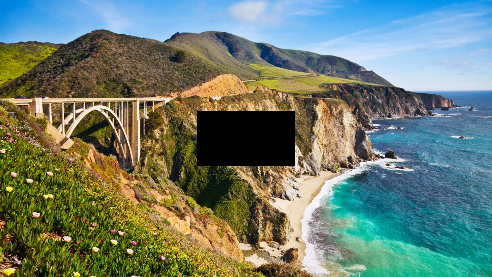

# 🔬 Watermark Robustness Test Summary

This table summarizes the decoding results for each attack across the three watermarking methods: `dwtDct`, `dwtDctSvd`, and `rivaGan`.

| **Attack**              | **Image**                                                                    | **dwtDct**                | **dwtDctSvd**                | **rivaGan**       |
| ----------------------- |------------------------------------------------------------------------------| ------------------------- | ---------------------------- | ----------------- |
| No Attack               |                            | ✅ `qingquan`              | ✅ `qingquan`                 | ✅ `qing`          |
| JPEG Compression (Q=40) |  | ❌ `\x00\x00\x00\x00@\x00` | ❌ `P\x00\x00\x03 0 $`        | ✅ `qing`          |
| Resize (50%)            |                        | ✅ `qingquan`              | ✅ `qingquan`                 | ✅ `qing`          |
| Gaussian Noise (std=5)  |    | ✅ `qingquan`              | ✅ `qingquan`                 | ✅ `qing`          |
| Crop (7x5%)             |                          | ❌ `[UTF-8 Error]`         | ❌ `[UTF-8 Error]`            | ✅ `qing`          |
| Brightness x1.2         |                | ✅ `qingquan`              | ❌ `[UTF-8 Error]`            | ✅ `qing`          |
| Overlay (Smiley)        |                | ✅ `qingquan`              | ✅ `qingquan`                 | ✅ `qing`          |
| Mask (20%)              |                            | ✅ `qingquan`              | ✅ `qingquan`                 | ✅ `qing`          |
| Rotate (30°)            |                         | ❌ `[UTF-8 Error]`         | ❌ `\x00\x00\x00\x00\x00\x02` | ❌ `[UTF-8 Error]` |

Legend:

* ✅: Exact match with expected watermark.
* ❌: Failure or decoding error.
* UTF-8 Error indicates corrupted or malformed decoding.

> Note: `rivaGan` only supports 32-bit watermarks, which is why its decoded string is shorter (`qing` instead of `qingquan`).
